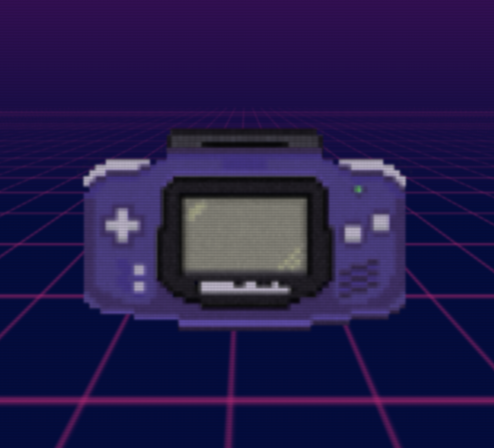

# GBA

* Your first Generative Blockchain Ai GBA (GameBoyAdvance). 
* Unlimited Creation, Gasless, and Monetization experience.



# The problem it solves

```
The rapid development of AI has brought new opportunities to the gaming industry, including the realm of GameFi. However, the integration of AI with GameFi is still in its early exploratory phase, and the key challenge is how to combine on-chain and off-chain elements smoothly. 
Reflecting on my childhood, the profound memories provided by GameBoy and its game cartridges are unforgettable. This feeling is what we want to experience while playing games. Hence, our team aims to introduce a new GameFi + AI paradigm to everyone as an experimental demo, incorporating existing technologies such as EIP2612, allowing users to earn money in GameFi + AI while experiencing the joy of AGI games with a gasless experience. 
In our design, each GBA game cartridge is an NFT, a Bounty Pool, a decryption/exploration/interactive game, and also a Prompt. 
Everyone can create game content through Prompts, and mint their own cartridges for others to play. 
Players can enjoy the Prompt game by inserting the cartridge, and interacting with our AI Agent to explore. 
Player needs to guess the riddles or find out the methods to pass the game, and submit their answers (or perform a blockchain operation). 
Each submission of an answer requires a Ticket fee, of which 80% is paid to the cartridge's Owner, 10% is paid to the GBA community, and 10% is used to increase the size of the prize pool, introducing a novel FOMO (Fear of Missing Out) mechanism. If a player solves the puzzle, congratulations, they can win all the prize money in the pool! This is not only our FOMO  mechanism but also allows game creators to balance the difficulty and quality of the game for profit, thereby incubating a large number of high-quality games within the community.

To ensure that users can enjoy a gasless gaming experience, GBA obtains user authorization through EIP2612 to cover gas fees on behalf of users during the game, maintaining the protocol's security while decentralizing. 
```